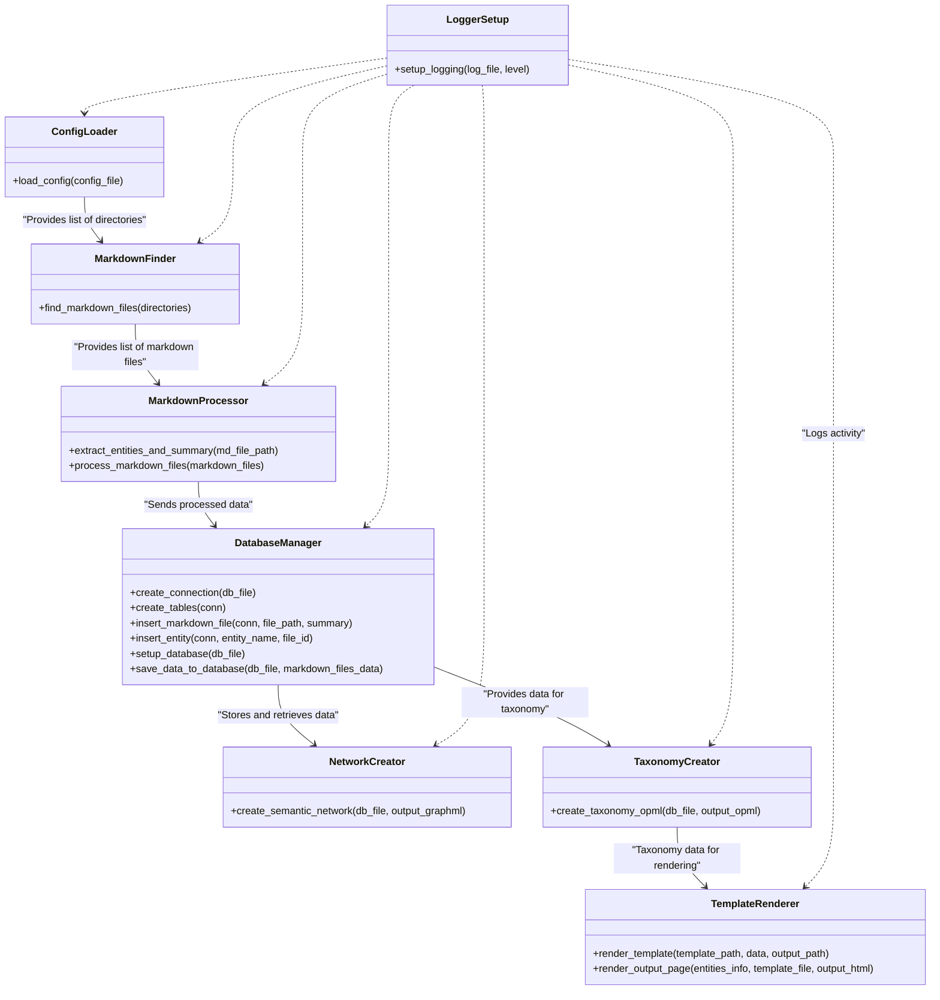
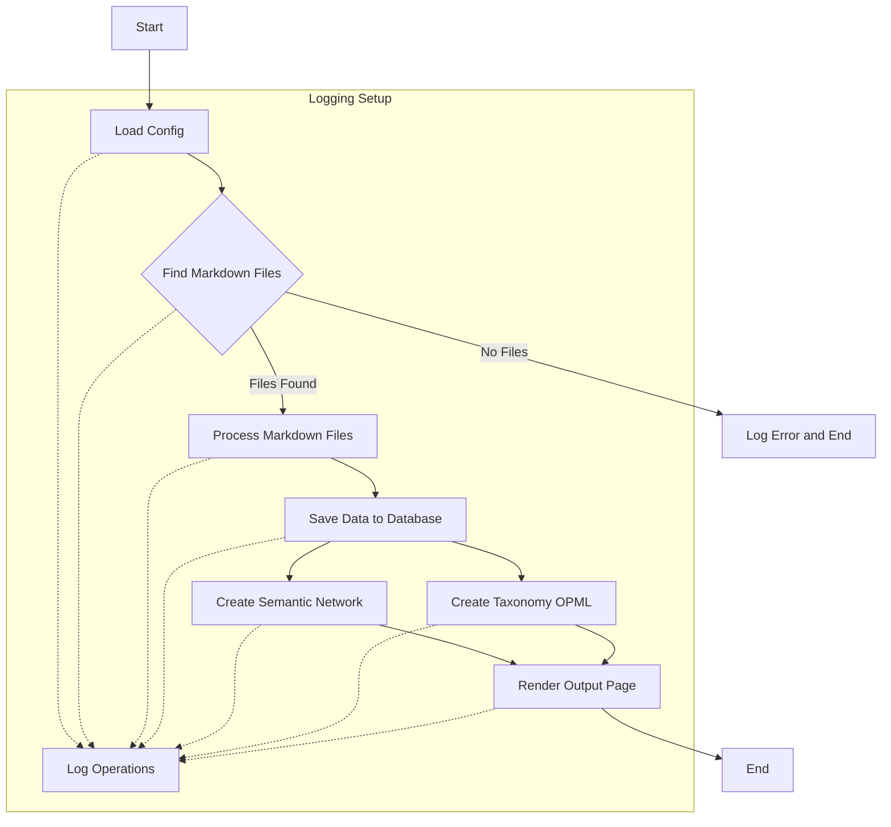

# Python Application Module Documentation

This document provides an overview of each module in the Python application designed for analyzing and visualizing markdown files. The application is composed of several modules, each handling a specific aspect of the process.

## Overview

Creating a component diagram for your application will help visualize the relationships and dependencies between the different modules. Below is a description of the application's structure, followed by a component diagram using Mermaid.js syntax.

### Application Structure Description

The application consists of several interconnected modules, each responsible for a specific part of the process:

- **Config Loader (`config_loader.py`)**: Reads the application configuration from a YAML file, primarily listing directories containing markdown files.
- **Markdown Finder (`markdown_finder.py`)**: Searches the specified directories for markdown files and lists their paths.
- **Markdown Processor (`markdown_processor.py`)**: Processes each markdown file to extract entities, generates summaries, and performs basic sentiment analysis.
- **Database Manager (`database_manager.py`)**: Manages a SQLite database to store information about markdown files, entities extracted, and summaries.
- **Network Creator (`network_creator.py`)**: Uses the data stored in the database to create a semantic network of entities and saves it in a `.graphml` format.
- **Taxonomy Creator (`taxonomy_creator.py`)**: Organizes entities into a hierarchy based on similarity and outputs the taxonomy as an OPML file.
- **Template Renderer (`template_renderer.py`)**: Formats the processed data into an HTML document using mustache templates.
- **Logger Setup (`logger_setup.py`)**: Configures global logging for the application, ensuring all modules log their activity consistently.

### Component Diagram in Mermaid.js Syntax

## Flow of information

### Process Flow Diagram

### Workflow Description:

1. **Start**: The entry point of the application.
2. **Load Config**: Loads directories from a YAML configuration file.
3. **Find Markdown Files**: Searches directories for markdown files.
4. **Process Markdown Files**: Extracts entities and generates summaries from markdown files.
5. **Save Data to Database**: Stores the processed information in a database.
6. **Create Semantic Network**: Builds a semantic network from the entities and saves it as a `.graphml` file.
7.

 **Create Taxonomy OPML**: Organizes entities into a hierarchy based on similarity and outputs as an OPML file.
8. **Render Output Page**: Formats the processed data into an HTML document using mustache templates.
9. **End**: The final step in the workflow.

The **Logging Setup** is a cross-cutting concern that interacts with all major steps of the process, ensuring operations are logged throughout the application's execution.

This updated documentation includes the `taxonomy_creator.py` module and adjusts the Mermaid.js diagrams to reflect the taxonomy creation process as an integral part of the application workflow.
## Parts of the application

### `config_loader.py`

Responsible for loading configuration settings from a YAML file, which primarily includes directories that contain markdown files to be processed.

#### Functions:

- `load_config(config_file)`: Loads directories from the specified YAML configuration file.

^### `markdown_finder.py`

Finds markdown (.md) files within the specified directories.

#### Functions:

- `find_markdown_files(directories)`: Recursively searches for markdown files in the specified directories and returns their paths.

### `markdown_processor.py`

Extracts relevant information from markdown files, such as entities and generates summaries.

#### Functions:

- `extract_entities_and_summary(md_file_path)`: Extracts entities from a markdown file and generates a simple summary.
- `process_markdown_files(markdown_files)`: Processes each markdown file to extract entities and generate summaries.

### `database_manager.py`

Creates a SQLite database to store and manage the extracted data from markdown files.

#### Functions:

- `create_connection(db_file)`: Creates a database connection to the SQLite database specified by `db_file`.
- `create_tables(conn)`: Creates tables in the database based on a predefined schema.
- `insert_markdown_file(conn, file_path, summary)`: Inserts a markdown file and its summary into the database.
- `insert_entity(conn, entity_name, file_id)`: Inserts an entity related to a markdown file into the database.
- `setup_database(db_file)`: Sets up the database, creating a connection and tables.
- `save_data_to_database(db_file, markdown_files_data)`: Saves processed data to the database.

### `network_creator.py`

Constructs a semantic network from the entities, illustrating their relationships, and saves it as a `.graphml` file.

#### Functions:

- `create_semantic_network(db_file, output_graphml)`: Creates a semantic network from entities in the database and saves it as a .graphml file.

### `template_renderer.py`

Formats output pages using mustache templates.

#### Functions:

- `render_template(template_path, data, output_path)`: Renders a mustache template with the provided data and saves the output to a file.
- `render_output_page(entities_info, template_file, output_html)`: Prepares data and calls `render_template` to generate the output HTML file.

### `logger_setup.py`

Configures the logging for the application, ensuring that log messages are both printed to the console and written to a log file.

Certainly! Below is a description of the `taxonomy_creator` module and its main function for inclusion in the functions section of your application documentation.

### `taxonomy_creator.py`

The `taxonomy_creator.py` module is designed to organize entities extracted from markdown files into a hierarchical structure based on their similarity. It leverages hierarchical clustering to understand and visualize the relationships between entities, ultimately outputting the taxonomy as an OPML file. This format is suitable for outlines, making it a versatile choice for representing hierarchical data.

#### Functions:

- **`create_taxonomy_opml(db_file, output_opml)`**: This is the primary function of the module. It takes the path to the SQLite database file (`db_file`) containing entities and their associated markdown files, and the path where the OPML file (`output_opml`) should be saved.

    - **Parameters**:
        - `db_file`: A string specifying the path to the SQLite database file. This database should contain the entities and the files they are associated with, as extracted and processed by previous components of the application.
        - `output_opml`: A string specifying the output path for the OPML file that will represent the entity taxonomy.

    - **Functionality**: The function first fetches entities and their occurrences from the database to construct an entity-file matrix. This matrix serves as the basis for calculating similarity between entities based on their co-occurrence across different markdown files. Hierarchical clustering is applied to this similarity matrix to deduce the hierarchical relationships between entities. The resulting hierarchical structure is then formatted into an OPML document, which is saved to the specified output path.

    - **Outcome**: The OPML file created by this function represents the taxonomy of entities, organizing them into a hierarchy that reflects their relationships based on textual similarity. This file can be used in various applications that support OPML to visualize or further analyze the structure of knowledge contained in the processed markdown files.

The `taxonomy_creator.py` module adds a critical layer of analysis to the application, enabling not just the extraction and processing of entities, but also the understanding of their interrelations in a structured format that is both human-readable and machine-processable.

#### Functions:

- `setup_logging(log_file, level)`: Sets up the application's logging configuration.

## Related content

- [Semantic Mapper - Original sketch](appplication_orginal.md)
- [MarkNet Analyzer](readme.md)