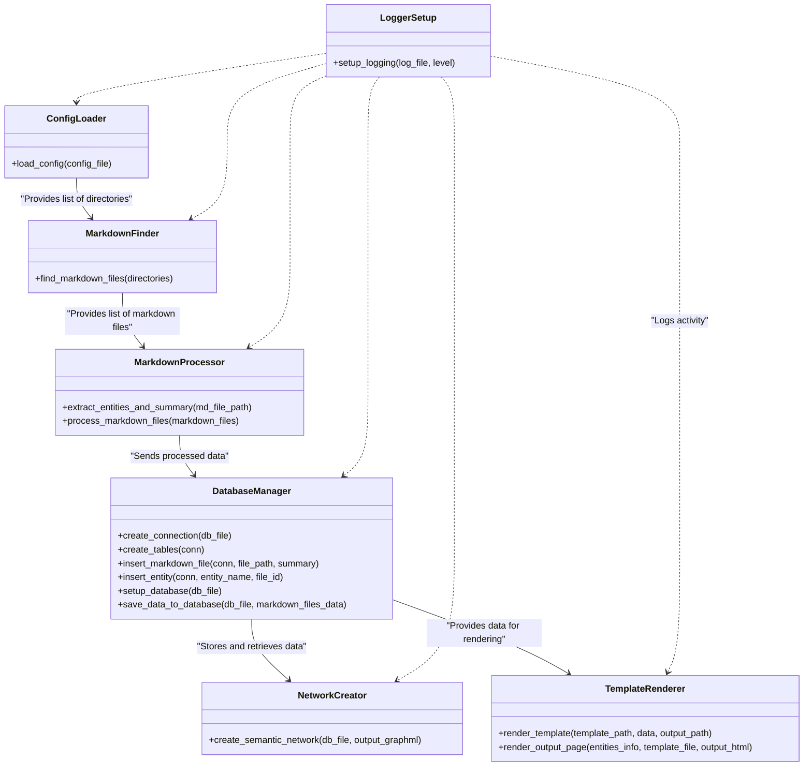
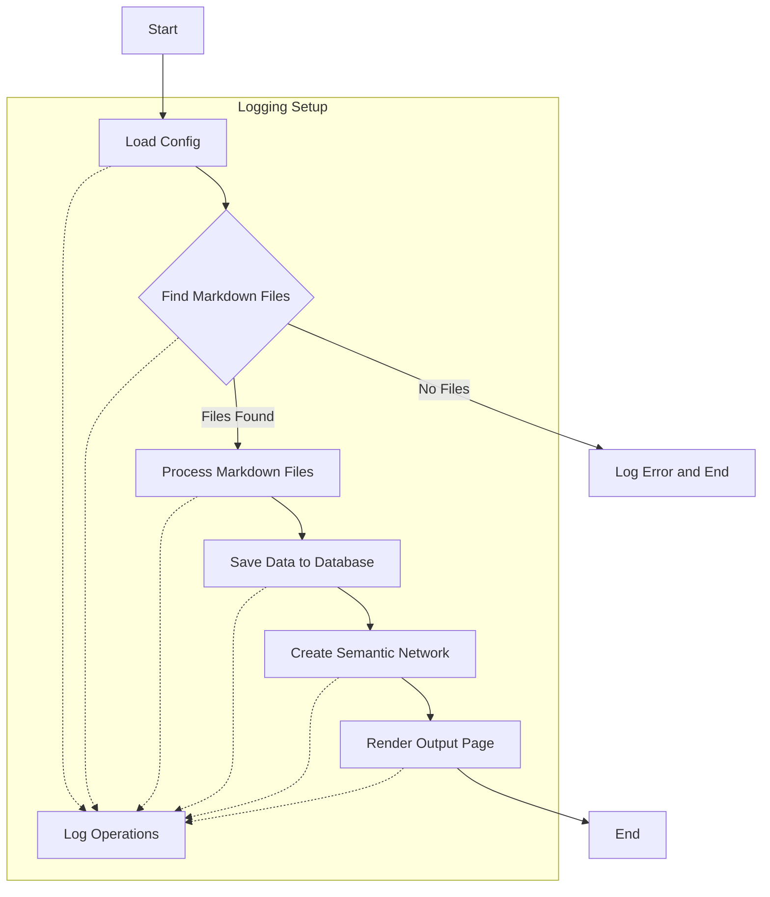

# Python Application Module Documentation

This document provides an overview of each module in the Python application designed for analyzing and visualizing markdown files. The application is composed of several modules, each handling a specific aspect of the process.

## Overview

Creating a component diagram for your application will help visualize the relationships and dependencies between the different modules. Below is a description of the application's structure, followed by a component diagram using Mermaid.js syntax.

### Application Structure Description

The application consists of several interconnected modules, each responsible for a specific part of the process:

- **Config Loader (`config_loader.py`)**: Reads the application configuration from a YAML file, primarily listing directories containing markdown files.
- **Markdown Finder (`markdown_finder.py`)**: Searches the specified directories for markdown files and lists their paths.
- **Markdown Processor (`markdown_processor.py`)**: Processes each markdown file to extract entities, generates summaries, and performs basic sentiment analysis.
- **Database Manager (`database_manager.py`)**: Manages a SQLite database to store information about markdown files, entities extracted, and summaries.
- **Network Creator (`network_creator.py`)**: Uses the data stored in the database to create a semantic network of entities and saves it in a `.graphml` format.
- **Template Renderer (`template_renderer.py`)**: Formats the processed data into an HTML document using mustache templates.
- **Logger Setup (`logger_setup.py`)**: Configures global logging for the application, ensuring all modules log their activity consistently.

### Component Diagram in Mermaid.js Syntax

This Mermaid.js syntax describes the application's components and their relationships:

- Arrows (`-->`) indicate a direct data flow or dependency between components.
- Dotted lines (`..>`) represent a logging relationship, indicating that these components utilize the LoggerSetup for logging purposes.

You can render this diagram in any Markdown viewer that supports Mermaid.js syntax, such as GitHub or GitLab, or in dedicated Mermaid live editors and visualization tools.

## Flow of information

Below is a Mermaid.js syntax diagram that illustrates the workflow of information through your system, highlighting how each component interacts and the sequence of operations from reading the configuration to rendering the output page.

### Process Flow Diagram

### Workflow Description:

1. **Start**: The entry point of the application.
2. **Load Config**: The `config_loader.py` loads directories to search from a YAML configuration file.
3. **Find Markdown Files**: The `markdown_finder.py` module searches the specified directories for markdown files.
   - If no markdown files are found, an error is logged, and the process ends.
4. **Process Markdown Files**: The `markdown_processor.py` analyzes the markdown files to extract entities and generate summaries.
5. **Save Data to Database**: The `database_manager.py` stores the extracted information (entities, summaries) in a SQLite database.
6. **Create Semantic Network**: The `network_creator.py` uses the information in the database to build a semantic network of entities, saving it as a `.graphml` file.
7. **Render Output Page**: The `template_renderer.py` formats the processed data into an HTML document using a mustache template.
8. **End**: The final step in the workflow, where the process concludes successfully.

The **Logging Setup** (represented as `logging` in the diagram) is a cross-cutting concern that interacts with all major steps of the process, ensuring that operations are logged throughout the application's execution.

This workflow diagram provides a high-level overview of the application's process flow, making it easier to understand how information moves through the system and how the components interact with each other. You can use this diagram in documentation or as a guide for further development and debugging.

## Parts of the application

### `config_loader.py`

Responsible for loading configuration settings from a YAML file, which primarily includes directories that contain markdown files to be processed.

#### Functions:

- `load_config(config_file)`: Loads directories from the specified YAML configuration file.

^### `markdown_finder.py`

Finds markdown (.md) files within the specified directories.

#### Functions:

- `find_markdown_files(directories)`: Recursively searches for markdown files in the specified directories and returns their paths.

### `markdown_processor.py`

Extracts relevant information from markdown files, such as entities and generates summaries.

#### Functions:

- `extract_entities_and_summary(md_file_path)`: Extracts entities from a markdown file and generates a simple summary.
- `process_markdown_files(markdown_files)`: Processes each markdown file to extract entities and generate summaries.

### `database_manager.py`

Creates a SQLite database to store and manage the extracted data from markdown files.

#### Functions:

- `create_connection(db_file)`: Creates a database connection to the SQLite database specified by `db_file`.
- `create_tables(conn)`: Creates tables in the database based on a predefined schema.
- `insert_markdown_file(conn, file_path, summary)`: Inserts a markdown file and its summary into the database.
- `insert_entity(conn, entity_name, file_id)`: Inserts an entity related to a markdown file into the database.
- `setup_database(db_file)`: Sets up the database, creating a connection and tables.
- `save_data_to_database(db_file, markdown_files_data)`: Saves processed data to the database.

### `network_creator.py`

Constructs a semantic network from the entities, illustrating their relationships, and saves it as a `.graphml` file.

#### Functions:

- `create_semantic_network(db_file, output_graphml)`: Creates a semantic network from entities in the database and saves it as a .graphml file.

### `template_renderer.py`

Formats output pages using mustache templates.

#### Functions:

- `render_template(template_path, data, output_path)`: Renders a mustache template with the provided data and saves the output to a file.
- `render_output_page(entities_info, template_file, output_html)`: Prepares data and calls `render_template` to generate the output HTML file.

### `logger_setup.py`

Configures the logging for the application, ensuring that log messages are both printed to the console and written to a log file.

#### Functions:

- `setup_logging(log_file, level)`: Sets up the application's logging configuration.

---

Each module is designed to be independently functional, allowing for easy modification and testing. Together, they form a comprehensive system for analyzing, processing, and visualizing markdown file content.
